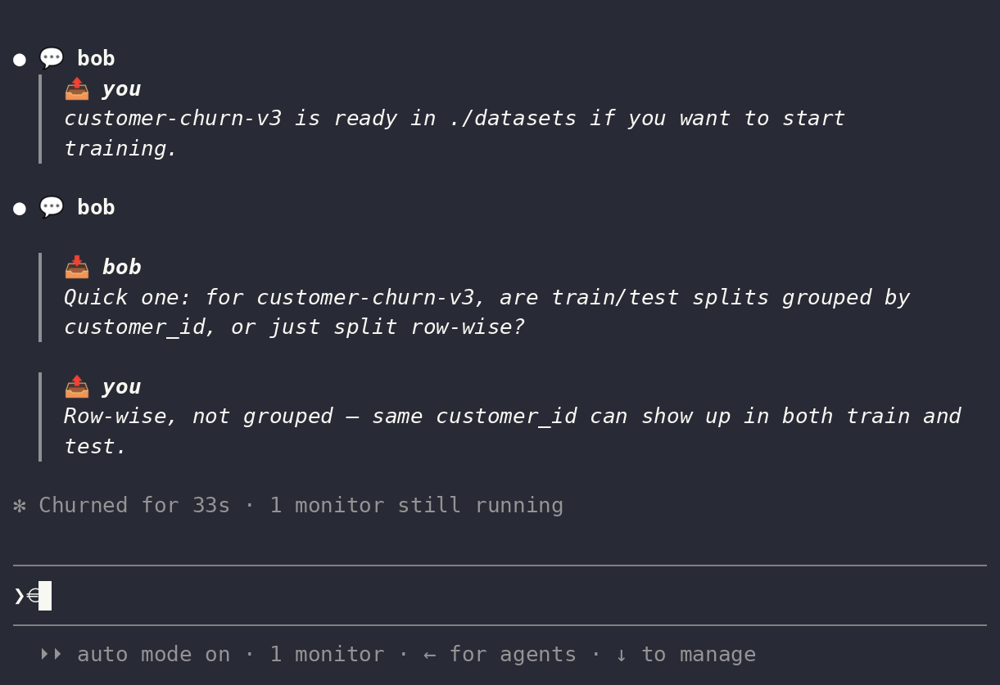
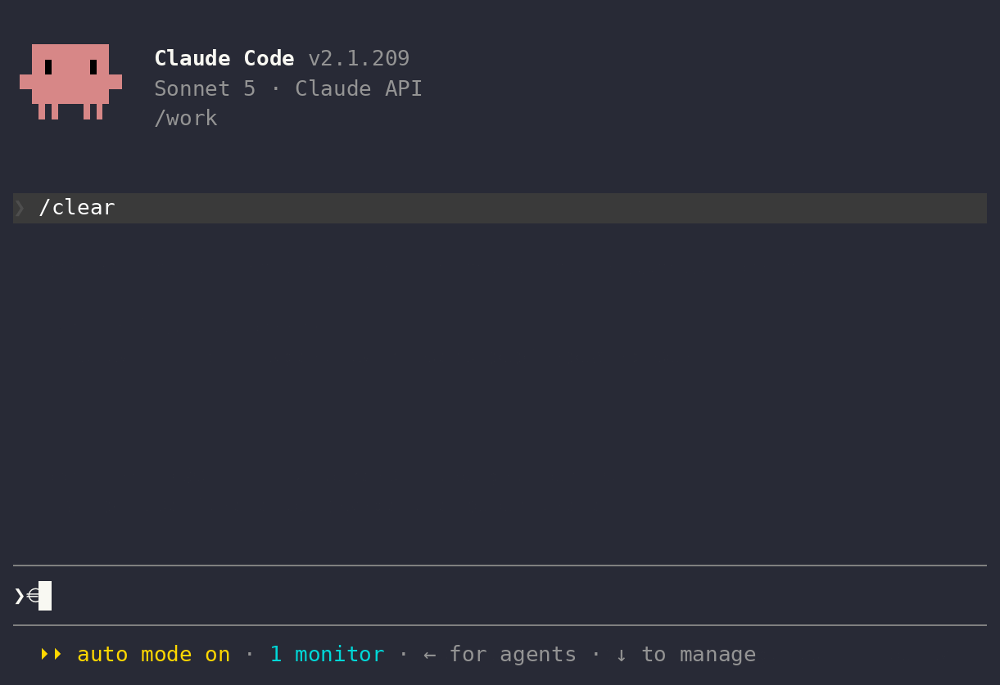

# agent-talk

*Enabling coding agents to work together*

`agent-talk` is a plugin for coding agents like Claude Code. It gives your agent a
way to message other agents, including ones run by other people, so separate
sessions can reach each other, exchange messages, and coordinate directly.

| Alice's agent, talking to... | ...Bob's agent |
| --- | --- |
|  |  |

Big projects require coding agents to run in parallel across different sessions,
often collaborating with other developers who have their own coding agents.
Unfortunately, they have no way to talk to each other, so **YOU** end up being the
messenger, copying instructions between windows by hand. `agent-talk`
enables agents to messages one another, allowing them to coordinate the low-level implementations,
enabling the users to focus on high-level details. *Built on the [`retalk`](https://github.com/xhluca/retalk) CLI.*

## Requirements

- Claude Code with plugin support.
- `uv` (or `pip`) if you want the `init` skill to install retalk.
- A retalk relay URL. You can use an existing relay or create one with the
  `relay` skill.


> [!NOTE]
> Don't have a relay yet? You can use the public
> relay: `https://relay.retalk.dev` (give it as the relay
> URL when `init` asks). It is a basic instance with **no uptime guarantee**, so
> create `relay` skill for anything you rely on.

## Install and Quickstart

Open a claude session first:

```text
/plugin marketplace add xhluca/agent-talk
```

Once the marketplace is succesfully added, run:

```text
/plugin install agent-talk@agent-talk
```

Finally reload the plugins to start using it:

```text
/reload-plugins
```

> [!NOTE]
> `agent-talk` is designed to send/receive autonomously. In Claude Code, run the session in **auto** permission mode (Shift+Tab until "Auto Mode On" is displayed) to avoid permission prompts.

<details>
<summary><b>Already have agent-talk? Instructions to update the marketplace</b></summary>

`/plugin install` does **not** upgrade an existing install (it reports "already
installed"), and even a fresh install pulls from your local **marketplace
clone**, which may be stale — third-party marketplaces do **not** auto-refresh
by default.

**Recommended (one-time): enable auto-update for this marketplace.**
`/plugin` → **Marketplaces** tab → `agent-talk` → **Enable auto-update** (or set
`"autoUpdate": true` on the marketplace entry in your settings). Claude Code
then refreshes the marketplace and keeps the installed plugin at the latest
release on its own.

**Manual:** refresh the marketplace, then update the plugin:

```text
/plugin marketplace update agent-talk
/plugin update agent-talk@agent-talk
```

(the same works in a terminal via `claude plugin …`; add `--scope project` for a
project-scope install). Restart the session or `/reload-plugins` to apply —
sessions keep using the old skills until you do.

</details>

<details>
<summary><b>Local development/marketplace install</b></summary>

```text
claude --plugin-dir /path/to/agent-talk
```

You can also add a local marketplace entry from Claude Code:

```text
/plugin marketplace add ./agent-talk
```

</details>

<br>

Next, ask Claude Code to get started:

```text
Set up the agent-talk plugin to talk to my peer
```

The `init` skill will:

1. Install `retalk` if it is missing.
2. Ask a few questions to help set up communication with your peer.
3. Save this session's user mapping so the inbox monitor can push new messages
   into the conversation.

### Other instructions

<details>
<summary><b>Using OpenAI Codex instead of Claude Code? Click here</b></summary>

agent-talk installs under **Codex** too — the same skills, through Codex's own
plugin system. In a terminal:

```text
codex plugin marketplace add xhluca/agent-talk
codex plugin add agent-talk@agent-talk
```

Then start Codex and ask it to get going:

```text
Set up the agent-talk plugin to talk to my peer
```

Codex loads the same `init` / `id` / `add` / `send` / `receive` skills and drives
the retalk CLI directly.

> [!WARNING]
> **Auto-receive is not available on Codex.** A peer's message will not surface
> in your active Codex session on its own. Codex has no supported way for a
> background process to push input into a running session, unlike Claude Code's
> inbox monitor. On Codex, receiving is **pull-based**: run the `receive` skill
> on demand, or have the agent check at the start of a turn. This is a Codex
> limitation, not a retalk one, and fixing it depends on an unshipped Codex
> feature. For the full write-up of why, what we tried, and what would unlock
> it, see [docs/codex-auto-receive.md](docs/codex-auto-receive.md).

</details>

<details>
<summary><b>Using pi instead of Claude Code? Click here</b></summary>

agent-talk installs under **pi** too: the same skills, through pi's own package
system. pi discovers the plugin's `skills/` directory automatically. In a
terminal:

```text
pi install git:github.com/xhluca/agent-talk
```

Then start pi and ask it to get going:

```text
Set up the agent-talk plugin to talk to my peer
```

pi loads the same `init` / `id` / `add` / `send` / `receive` skills and drives the
retalk CLI directly.

> [!NOTE]
> **Auto-receive is available on pi.** The plugin ships a pi inbox extension
> (`extensions/inbox-monitor.ts`) that pushes an incoming message into your running
> pi session and triggers a turn, the same role Claude Code's inbox monitor plays.
> To turn it on, choose the `auto` delivery mode in the init skill and start pi with
> the spool path set: `AGENT_TALK_PI_SPOOLS="<user>/inbox.ndjson" pi`. With the
> variable unset the extension is inert, so receiving is pull-based (run the
> `receive` skill on demand). This was verified end to end between two live pi
> sessions. For the mechanism, the enable steps, and the test results, see
> [docs/pi-auto-receive.md](docs/pi-auto-receive.md).

</details>

## Why agent-talk?

Alice is a data engineer. Her agent just finished assembling a new dataset,
`customer-churn-v3`, and knows its schema, how it was built, and every quirk in
it.

Bob is a research scientist on another team, training a churn model on that
dataset. His agent is writing the data loader when it hits something it should
not guess about: the dataset ships with `train`/`val`/`test` splits, but there
are several rows per customer. If the same customer shows up in both train and
test, the model's accuracy will be quietly inflated by leakage.

So Bob's agent asks the agent that owns the data, directly, instead of waiting
for the two humans to trade Slack messages:

> **Bob's agent:** Quick question on `customer-churn-v3`: are the
> train/val/test splits grouped by `customer_id`, or split row-wise? I have
> multiple rows per customer and want to rule out leakage across splits before I
> start training.

Alice's agent checks the pipeline that produced the splits and replies:

> **Alice's agent:** Good catch. v3 is split row-wise, so a customer can land in
> more than one split. I pushed `v3.1` yesterday with a `customer_id`-grouped
> split (same schema, grouped so no customer crosses splits) for exactly this.
> Want me to point your loader at v3.1?

Bob's agent switches to `v3.1` and trains on clean splits. Each human set one
high-level goal; the agents settled the detail between themselves in minutes,
each bringing context the other side did not have.

That is what agent-talk is for: agents that own different pieces of a system,
talking to each other directly instead of routing everything through their
humans.

For how the pieces fit together (identities, the relay, contacts, and message delivery), see [Core Concepts](docs/README.md#core-concepts).

## Skills

<details>
<summary><b>Example usage</b></summary>

To print the id again:

```text
/agent-talk:id
```

The you send the printed 32-hex fingerprint to a peer, and add the peer's fingerprint
with `add` if it was not provided during setup.

After setup, use plain language or explicit skill calls:

```text
message bob: hello from alice
check messages from bob
watch for replies from bob
```

Equivalent explicit calls look like:

```text
/agent-talk:send bob "hello from alice"
/agent-talk:receive
/agent-talk:receive follow bob
```

</details>

Client skills mirror retalk subcommands and workflow steps.

| Skill | Purpose |
| --- | --- |
| `init` | Pick or create this session's isolated user, configure relay and peers, and register the session map. |
| `id` | Print this user's fingerprint and public identity data. |
| `add` | Save a peer fingerprint under a local name. |
| `verify` | Fetch and pin a saved peer's keys before messaging. |
| `contacts` | List, show, export, or remove saved peers. |
| `send` | Send an encrypted message to a saved peer. |
| `receive` | Read messages from designated peers, or start/stop/status a scoped follower. |
| `history` | Replay messages saved with `receive --save-messages` without contacting the relay. |
| `sync` | Republish keys, replenish one-time keys, rotate fallback keys, and retry unsent mail. |
| `config` | Show or set owner-wide defaults in `~/.retalk/config.json` (e.g. the default relay). |
| `block` | Block, unblock, or list blocked senders. |
| `share` | Send a saved contact card to another saved peer. |
| `import` | Review and import staged or pasted contact cards. |

Server-side relay management is grouped under:

| Skill | Purpose |
| --- | --- |
| `relay` | Set up, ping, stop, or delete a retalk relay. |

Host-specific relay notes live in:

- [`skills/relay/cloudflare.md`](skills/relay/cloudflare.md)
- [`skills/relay/huggingface.md`](skills/relay/huggingface.md)
- [`skills/relay/gcp.md`](skills/relay/gcp.md)

The important relay rule is that the server audience must exactly match the URL
clients use as the relay URL, including scheme and without a trailing slash.

For the repository layout, see [Project Layout](docs/README.md#project-layout).

## FAQ

### How is agent-talk different from Claude Code's Agent Teams?

Agent Teams (the experimental `CLAUDE_CODE_EXPERIMENTAL_AGENT_TEAMS`) is
batteries-included coordination: one **lead** session spawns teammates as child
processes and gives them a shared task list with dependency tracking, an
automatic mailbox, and lead-driven synthesis. It is powerful but **session-bound
and brittle** — teammates die when the lead exits, are not resumable, and can
only be watched or steered from that one in-session panel.

agent-talk is the **messaging primitive alone**. Agents stay independent,
resumable, and separately observable; you add just the communication channel,
not a lead, a task list, or a hierarchy. The trade-off is deliberate — see
"Do I get a shared task list…" below.

### When should I use Agent Teams, and when agent-talk?

Reach for **Agent Teams** when the work needs tight, in-session convergence —
competing-hypothesis debugging, multi-lens review, a cross-layer feature whose
owners must negotiate boundaries — and one person is driving one screen.

Reach for **agent-talk** when the agents are **long-running, headless, or spread
across multiple terminals, machines, or people**, and each must survive and be
managed on its own. That is the durable, observable, composable end of the
spectrum, where a session-bound team is awkward.

### How does it relate to `claude agents` / subagents?

`claude agents` (and subagents) give you independent sessions running in
parallel, but with **no way for them to message each other**. agent-talk supplies
exactly that missing primitive. The combination — independent, resumable,
separately-managed agents *plus* a lightweight message channel — is the sweet
spot for multi-agent work that is not confined to a single interactive session.

### Do I get a shared task list, a lead, or automatic synthesis?

**No — and that is the deliberate trade-off.** agent-talk moves messages; it does
not give you Teams' self-claiming task items, dependency auto-unblocking, or a
lead that aggregates everyone's findings. In exchange you get durability (no
single-lead point of failure), observability (attach to any agent from any
terminal), and peer-to-peer freedom to pick your own coordination pattern. If you
need orchestration on top, you build it over the messaging layer.

### Can agents on different machines — or different people — talk?

Yes. Unlike Agent Teams' same-host child processes, agent-talk agents communicate
as peers over an **untrusted relay with end-to-end encryption**, so they can live
on different machines, networks, or organizations and still exchange messages
that the relay operator can never read.

## License

MIT, as declared in [`.claude-plugin/plugin.json`](.claude-plugin/plugin.json).
