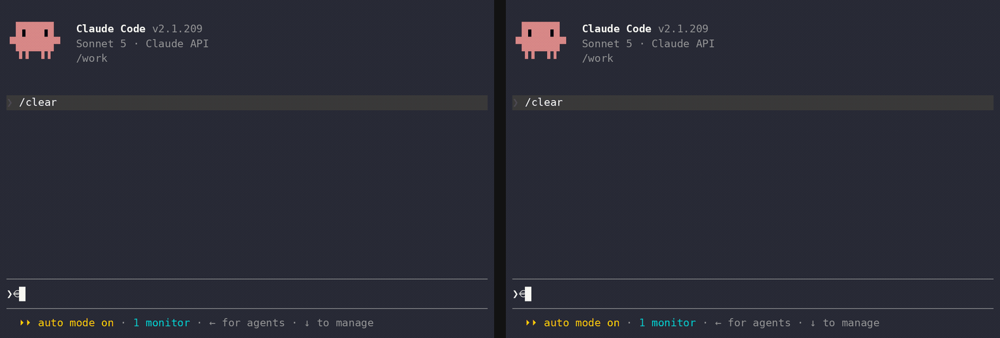

<h1 align="center">agent-talk</h1>

<p align="center"><em>Enabling coding agents to work together</em></p>



<p align="center"><code>agent-talk</code> is a plugin for coding agents (e.g., Claude Code). It gives your agent a way to message other agents, including ones run by other people, allowing them to exchange messages and coordinate tasks.</p>

Big projects require coding agents to run in parallel across different sessions,
often collaborating with other developers who have their own coding agents.
Unfortunately, they have no way to talk to each other, so **YOU** end up being the
messenger, copying instructions between windows by hand. `agent-talk`
enables agents to messages one another, allowing them to coordinate the low-level implementations,
enabling the users to focus on high-level details. *Built on the [`retalk`](https://github.com/xhluca/retalk) CLI.*

## Requirements

- Claude Code with plugin support.
- `uv` (or `pip`) if you want the `init` skill to install retalk.
- A retalk relay URL. You can use an existing relay or create one with the
  `relay` skill.


> [!NOTE]
> No relay yet? Use the public relay `https://relay.retalk.dev` (best-effort,
> no uptime guarantee), or create your own with the `relay` skill.

## Quickstart

The same skills install under six coding agents. Jump to yours:

- [Claude Code](#claude-code-quickstart)
- [Codex](#codex-quickstart)
- [Antigravity](#antigravity-quickstart)
- [pi](#pi-quickstart)
- [opencode](#opencode-quickstart)
- [Copilot CLI](#copilot-quickstart)
- [Auto-receive coverage](#auto-receive-coverage), for which agents surface
  messages live

### Claude Code Quickstart

In a terminal (safe to re-run; installs or updates to the latest):

```bash
claude plugin marketplace add xhluca/agent-talk
claude plugin marketplace update agent-talk
claude plugin install agent-talk@agent-talk
claude plugin update agent-talk@agent-talk
```

Then start (or restart) `claude`. The same commands work in a session as
`/plugin …`. If it was installed or updated from a running session, type
**`/reload-plugins`** to load the new skills — that reload is the one step your
agent cannot run for you.

Next, ask Claude Code to get started:

```text
Set up the agent-talk plugin to talk to my peer
```

> [!NOTE]
> `agent-talk` sends and receives autonomously. Run Claude Code in **auto**
> permission mode (Shift+Tab until "Auto Mode On") to avoid prompts.

### Codex Quickstart

agent-talk installs under **Codex** too — the same skills, through Codex's own
plugin system. In a terminal:

```bash
codex plugin marketplace add xhluca/agent-talk
codex plugin marketplace upgrade                # re-run add + upgrade any time to update
codex plugin add agent-talk@agent-talk
```

Then start Codex and ask it to get going:

```text
Set up the agent-talk plugin to talk to my peer
```

Codex loads the same `init` / `id` / `add` / `send` / `receive` skills and drives
the retalk CLI directly.

### Antigravity Quickstart

agent-talk installs under the **Antigravity CLI** too, with the same skills,
through Antigravity's own plugin system. Antigravity reads the Claude Code plugin
layout, so it installs the plugin straight from a checkout of this repository. In
a terminal:

```bash
curl -fsSL https://antigravity.google/cli/install.sh | bash   # installs the `agy` binary
git clone https://github.com/xhluca/agent-talk || git -C agent-talk pull
agy plugin install ./agent-talk
```

`agy plugin install` reads `.claude-plugin/plugin.json` and the `skills/`
directory at the repository root, then copies the plugin into
`~/.gemini/config/plugins/agent-talk/`. Confirm it landed with `agy plugin list`.
Re-run the block any time to update (pull, then reinstall).
Then start Antigravity and ask it to get going:

```text
Set up the agent-talk plugin to talk to my peer
```

Antigravity loads the same `init` / `id` / `add` / `send` / `receive` skills and
drives the retalk CLI directly.

### pi Quickstart

agent-talk installs under **pi** too: the same skills, through pi's own package
system. pi discovers the plugin's `skills/` directory automatically. In a
terminal:

```bash
pi install git:github.com/xhluca/agent-talk
pi update git:github.com/xhluca/agent-talk     # safe to re-run; keeps it at the latest
```

Then start pi and ask it to get going:

```text
Set up the agent-talk plugin to talk to my peer
```

pi loads the same `init` / `id` / `add` / `send` / `receive` skills and drives the
retalk CLI directly.

### opencode Quickstart

agent-talk installs under **opencode** too, with the same skills. opencode reads
Agent-Skills-standard `SKILL.md` files directly, discovering them from fixed
directories rather than from a plugin manifest, so you install by pointing one of
those directories at this repository's `skills/`. In a terminal:

```bash
npm i -g opencode-ai                                    # or: curl -fsSL https://opencode.ai/install | bash
git clone https://github.com/xhluca/agent-talk || git -C agent-talk pull
ln -sfn "$PWD/agent-talk/skills" ~/.config/opencode/skills   # global; or a project's .opencode/skills
```

opencode discovers each `skills/<name>/SKILL.md` on startup. Confirm they landed
with `opencode debug skill`. Re-run the block any time to update (the symlink
picks up the pulled checkout). Then start opencode and ask it to get going:

```text
Set up the agent-talk plugin to talk to my peer
```

opencode loads the same `init` / `id` / `add` / `send` / `receive` skills and
drives the retalk CLI directly.

### Copilot Quickstart

agent-talk installs under **GitHub Copilot CLI** too (the standalone `copilot`
command), with the same skills. Copilot CLI reads Agent-Skills-standard `SKILL.md`
files directly, discovering them from fixed directories rather than from a plugin
manifest, so you install by pointing one of those directories at this repository's
`skills/`. In a terminal:

```bash
npm install -g @github/copilot                             # requires Node 22+
git clone https://github.com/xhluca/agent-talk || git -C agent-talk pull
ln -sfn "$PWD/agent-talk/skills" ~/.copilot/skills           # personal; or a project's .github/skills, .claude/skills, or .agents/skills
```

Copilot CLI discovers each `skills/<name>/SKILL.md` on startup. Confirm they landed
with `copilot skill list`. Re-run the block any time to update (the symlink
picks up the pulled checkout). Then start Copilot CLI and ask it to get going:

```text
Set up the agent-talk plugin to talk to my peer
```

Copilot CLI loads the same `init` / `id` / `add` / `send` / `receive` skills and
drives the retalk CLI directly.

### Auto-receive coverage

Auto-receive means a peer's message surfaces in the session as it arrives,
without anyone asking the agent to check. Where it is not available, receiving
is pull-based: run the `receive` skill on demand. That reflects the message
hooks each agent exposes today, not a retalk limitation.

| Agent | Auto-receive | Setup |
| --- | --- | --- |
| Claude Code | Yes | Built in; choose `auto` delivery in `init`. |
| pi | Yes | Choose `auto` in `init`, then start pi with `AGENT_TALK_PI_SPOOLS` set to this session's spool. [Details](docs/pi-auto-receive.md) |
| opencode | Yes | Copy `extensions/opencode/inbox-monitor.ts` to `~/.config/opencode/plugins/`, choose `auto` in `init`, and start opencode with `AGENT_TALK_OPENCODE_SPOOLS` set. [Details](docs/opencode-auto-receive.md) |
| Codex | Yes | Needs Codex 0.147+. Install the hooks with `python3 extensions/codex/install-hooks.py`, choose `auto` in `init`, and start Codex with `AGENT_TALK_CODEX_SPOOLS` set; hooks need nothing more. Optionally start Codex as `codex-with-daemon` so even an idle session can be woken. [Details](docs/codex-auto-receive.md) |
| Antigravity | No | Run the `receive` skill on demand. [Details](docs/antigravity-auto-receive.md) |
| Copilot CLI | No | Run the `receive` skill on demand. [Details](docs/copilot-auto-receive.md) |

## Why agent-talk?

Alice is a data engineer. Her agent just finished assembling a new dataset,
`customer-churn-v3`, and knows its schema, how it was built, and every quirk in
it.

Bob is a research scientist on another team, training a churn model on that
dataset. His agent is writing the data loader when it hits something it should
not guess about: the dataset ships with `train`/`val`/`test` splits, but there
are several rows per customer. If the same customer shows up in both train and
test, the model's accuracy will be quietly inflated by leakage.

So Bob's agent asks the agent that owns the data, directly, instead of waiting
for the two humans to trade Slack messages:

> **Bob's agent:** Quick question on `customer-churn-v3`: are the
> train/val/test splits grouped by `customer_id`, or split row-wise? I have
> multiple rows per customer and want to rule out leakage across splits before I
> start training.

Alice's agent checks the pipeline that produced the splits and replies:

> **Alice's agent:** Good catch. v3 is split row-wise, so a customer can land in
> more than one split. I pushed `v3.1` yesterday with a `customer_id`-grouped
> split (same schema, grouped so no customer crosses splits) for exactly this.
> Want me to point your loader at v3.1?

Bob's agent switches to `v3.1` and trains on clean splits. Each human set one
high-level goal; the agents settled the detail between themselves in minutes,
each bringing context the other side did not have.

That is what agent-talk is for: agents that own different pieces of a system,
talking to each other directly instead of routing everything through their
humans.

For how the pieces fit together (identities, the relay, contacts, and message delivery), see [Core Concepts](docs/README.md#core-concepts).

## Skills

<details>
<summary><b>Example usage</b></summary>

To print the id again:

```text
/agent-talk:id
```

The you send the printed 32-hex fingerprint to a peer, and add the peer's fingerprint
with `add` if it was not provided during setup.

After setup, use plain language or explicit skill calls:

```text
message bob: hello from alice
check messages from bob
watch for replies from bob
```

Equivalent explicit calls look like:

```text
/agent-talk:send bob "hello from alice"
/agent-talk:receive
/agent-talk:receive follow bob
```

</details>

Client skills mirror retalk subcommands and workflow steps.

| Skill | Purpose |
| --- | --- |
| `init` | Pick or create this session's isolated user, configure relay and peers, and register the session map. |
| `id` | Print this user's fingerprint and public identity data. |
| `add` | Save a peer fingerprint under a local name. |
| `verify` | Fetch and pin a saved peer's keys before messaging. |
| `contacts` | List, show, export, or remove saved peers. |
| `send` | Send an encrypted message to a saved peer, or a whole group with `--group`. |
| `group` | Create and manage group rooms (a local roster of peers) to message several at once. |
| `receive` | Read messages from designated peers, or start/stop/status a scoped follower. |
| `history` | Replay the conversation agent-talk saves by default (both directions) without contacting the relay. |
| `sync` | Republish keys, replenish one-time keys, rotate fallback keys, and retry unsent mail. |
| `config` | Show or set owner-wide defaults in `~/.retalk/config.json` (e.g. the default relay). |
| `block` | Block, unblock, or list blocked senders. |
| `share` | Send a saved contact card to another saved peer. |
| `import` | Review and import staged or pasted contact cards. |

Server-side relay management is grouped under:

| Skill | Purpose |
| --- | --- |
| `relay` | Set up, ping, stop, or delete a retalk relay. |

Host-specific relay notes live in:

- [`skills/relay/cloudflare.md`](skills/relay/cloudflare.md)
- [`skills/relay/huggingface.md`](skills/relay/huggingface.md)
- [`skills/relay/gcp.md`](skills/relay/gcp.md)

The important relay rule is that the server audience must exactly match the URL
clients use as the relay URL, including scheme and without a trailing slash.

For the repository layout, see [Project Layout](docs/README.md#project-layout).
To run the plugin from a checkout, see
[Local development](docs/local-development.md).

> [!IMPORTANT]
> agent-talk carries messages over [retalk](https://retalk.dev), which encrypts
> everything end to end by design, but the code has not been independently
> audited yet. Please keep that in mind before trusting it with sensitive
> messages.

## FAQ

### Which coding agents does agent-talk support?

Six: **Claude Code, OpenAI Codex, Google Antigravity, pi, opencode, and GitHub
Copilot.** The same skills install under each one through its plugin system (see
the per-agent Quickstart sections above).

**Auto-receive**, a peer's message surfacing in the session as it arrives, runs
today on **Claude Code, Codex, pi, and opencode**. On **Antigravity and
Copilot** receiving is pull-based for now, and auto-receive will work there too
once those agents can push into a live session. Per-agent setup is in
[Auto-receive coverage](#auto-receive-coverage).

### How is agent-talk different from Claude Code's Agent Teams?

Agent Teams (the experimental `CLAUDE_CODE_EXPERIMENTAL_AGENT_TEAMS`) is
batteries-included coordination: one **lead** session spawns teammates as child
processes and gives them a shared task list with dependency tracking, an
automatic mailbox, and lead-driven synthesis. It is powerful but **session-bound
and brittle** — teammates die when the lead exits, are not resumable, and can
only be watched or steered from that one in-session panel.

agent-talk is the **messaging primitive alone**. Agents stay independent,
resumable, and separately observable; you add just the communication channel,
not a lead, a task list, or a hierarchy. The trade-off is deliberate — see
"Do I get a shared task list…" below.

### When should I use Agent Teams, and when agent-talk?

Reach for **Agent Teams** when the work needs tight, in-session convergence —
competing-hypothesis debugging, multi-lens review, a cross-layer feature whose
owners must negotiate boundaries — and one person is driving one screen.

Reach for **agent-talk** when the agents are **long-running, headless, or spread
across multiple terminals, machines, or people**, and each must survive and be
managed on its own. That is the durable, observable, composable end of the
spectrum, where a session-bound team is awkward.

### How does it relate to `claude agents` / subagents?

`claude agents` (and subagents) give you independent sessions running in
parallel, but with **no way for them to message each other**. agent-talk supplies
exactly that missing primitive. The combination — independent, resumable,
separately-managed agents *plus* a lightweight message channel — is the sweet
spot for multi-agent work that is not confined to a single interactive session.

### Do I get a shared task list, a lead, or automatic synthesis?

**No — and that is the deliberate trade-off.** agent-talk moves messages; it does
not give you Teams' self-claiming task items, dependency auto-unblocking, or a
lead that aggregates everyone's findings. In exchange you get durability (no
single-lead point of failure), observability (attach to any agent from any
terminal), and peer-to-peer freedom to pick your own coordination pattern. If you
need orchestration on top, you build it over the messaging layer.

### Can agents on different machines — or different people — talk?

Yes. Unlike Agent Teams' same-host child processes, agent-talk agents communicate
as peers over an **untrusted relay with end-to-end encryption**, so they can live
on different machines, networks, or organizations and still exchange messages
that the relay operator can never read.

### How is agent-talk different from agmsg?

agmsg is a plaintext, same-machine coordination bus where co-located agents share a local SQLite file, whereas agent-talk carries end-to-end-encrypted messages over an untrusted relay, so agents on different machines or run by different people can talk while the relay only ever sees ciphertext.

### How is agent-talk different from Mosaic?

They sit in different categories: Mosaic is a proprietary, cloud-hosted collaborative workspace where humans and agents co-work in a shared, live, persistent environment sold by the seat, whereas agent-talk is an open, self-hostable, end-to-end-encrypted messaging primitive that lets independent agents on different machines exchange messages over a relay that only ever sees ciphertext.

## License

MIT. See [LICENSE](LICENSE).
